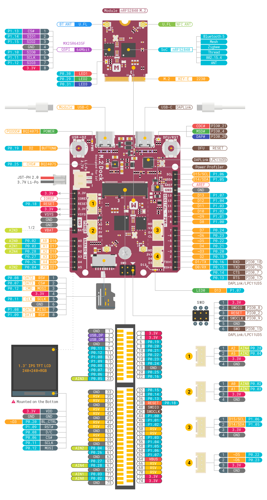

# nRF52840 M.2 Developer Kit <small>An open-source developer kit based on nRF52840 M.2 module, designed for IoT prototyping</small>

## Overview
nRF52840 M.2 Developer Kit is a versatile IoT prototyping platform, including the [nRF52840 M.2 Module](../nrf52840-m2) and [M.2 Dock](../m2-dock). You can use the Dev Kit to prototype your IoT solutions and then scale to production using the nRF52840 M.2 Module combined with your custom PCB hardware in a short time.

The [nRF52840 M.2 Module](../nrf52840-m2) is an M.2 E-Key form factor module for Bluetooth Low Energy, Bluetooth mesh, Thread, Zigbee, 802.15.4, ANT and 2.4 GHz proprietary applications on the nRF52840 SoC.

The [M.2 Dock](../m2-dock) extends the interfaces compared to the nRF52840 M.2 Module through an M.2 E-Key connector. This design also features a fully-integrated [DAPLink](https://armmbed.github.io/DAPLink/) debugger with [Power Profiling](power-profiling.md), enabling you to program, debug and perform real-time current profiling of your IoT applications without using external tools.

## Features
* nRF52840 M.2 Module
	- Nordic Semiconductor nRF52840 SoC
	- 64 MHz Arm® Cortex-M4 with FPU, 1 MB Flash + 256 KB RAM
	- Bluetooth 5, Bluetooth mesh, Thread, Zigbee, 802.15.4, ANT and 2.4 GHz proprietary
	- Arm TrustZone® Cryptocell 310 Security Subsystem
	- M.2 Key-E with USB 2.0, UART, SPI, TWI, PDM, I2S, PWM, ADC and up to 33 GPIOs
	- User programmable RGB LED
	- Ultra low power 64Mbit QSPI flash memory
	- U.FL/I-PEX MHF Connectors

* Integrated DAPLink Debugger
	- MSC - drag-n-drop programming flash memory
	- CDC - virtual com port for log, trace and terminal emulation
	- HID/WEBUSB HID - CMSIS-DAP compliant debug channel

* Advanced Power Profiling
	- Up to 690 mA current measurement
	- Voltage tracking
	- 30000 samples per second
	- Precision amplifiers with dual gain stage
	- Cross-platform utility available in Python

* 1.3" 240x240 Color IPS TFT LCD Display
* Li-Po Battery Charger with Power Path Management
* User programmable LED and Button
* 2.4 GHz and NFC cabled PCB antennas
* microSD card slot
* Arduino form factor
* 4 Grove Connectors
* Reversible USB-C Connectors

## Hardware Diagram

The hardware diagram of the nRF52840 M.2 Developer Kit is shown below:

## Included in the Box
|    **Part**                | **Qty** |
| -------------------------- | ------- |
| nRF52840 M.2 Module        | 1       |
| M.2 Dock                   | 1       |
| 2.4 GHz Cabled PCB Antenna | 1       |
| NFC Cabled PCB Antenna     | 1       |
| USB-C Cable                | 1       |

## Tutorials
We think the best way to learn is by doing. And to help you get started, we have provided a series of tutorials. Find the details below:

* [Getting Started with nRF52840 M.2 Developer Kit](getting-started.md)
* [How to Program the nRF52840 M.2 Module](programming.md)
* [Getting Started with Power Profiling](power-profiling.md)
* [nRF5 SDK Tutorials](nrf5-sdk/index.md)
* [Zephyr RTOS Tutorials](zephyr/index.md)

## Design Resource
* [nRF52840 M.2 Developer Kit Hardware Diagram V1.0](hw/)
* [nRF52840 M.2 Developer Kit 3D Model V1.0](hw/)
* [nRF52840 M.2 Module Documentation](hw/)
* [M.2 Dock Documentation](hw/)

## Create an Issue
Interested in contributing to this project? Want to report a bug? Feel free to click here:

<a href="https://github.com/makerdiary/nrf52840-m2-devkit/issues/new"><button data-md-color-primary="red-bud"><i class="fa fa-github"></i> Create an Issue</button></a>
