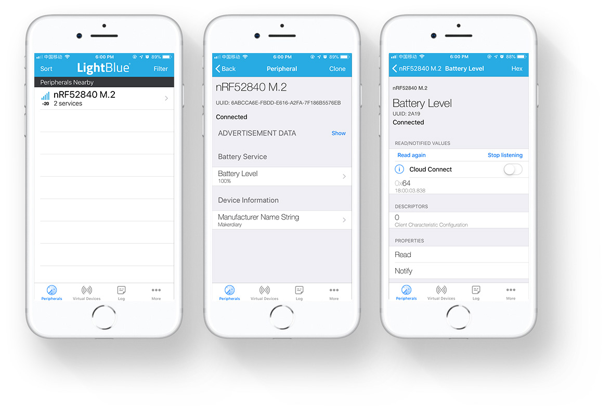

# BLE Battery Service Example

## Description

The BLE Battery Service Example demonstrates how to use the Battery Service module. This module implements the Battery Service with the Battery Level characteristic.

The application includes the two services:

* Battery Service
* Device Information Service

When the application starts, the BSP is initialized. Next, a timer for generating battery measurements is started. When notification of Battery Level characteristic is enabled, the Battery Level is notified each time the Battery Level measurement timer expires.


!!! Tip
	Before you start building, remember to set up the nRF5 SDK development environment first. See [Setup the nRF5 SDK](../setup.md) for details.

## Building the example

You can find the source code and the project file of the example in the following folder: [examples/nrf5-sdk/ble_app_bas](https://github.com/makerdiary/nrf52840-m2-devkit/tree/master/examples/nrf5-sdk/ble_app_bas).

Open terminal and navigate to the directory with the example Makefile:

``` sh
cd ./examples/nrf5-sdk/ble_app_bas/armgcc
```

Run `make merge` to build the application and merge the Softdevice:

``` sh
make merge
```

## Programming the firmware

If compiled successfully, the firmware is located in `ble_app_bas/armgcc/_build` with the name `nrf52840_xxaa_s140.hex`.

Connect the debugger USB port to your PC using the provided USB-C Cable. A disk drive called **M2-DOCK** will be automatically detected by the computer.


Drag and drop the firmware `nrf52840_xxaa_s140.hex` onto the **M2-DOCK** drive, or run the following command in `ble_app_bas/armgcc` to program the board:

``` sh
make flash_all
```

!!! Tip
	See **[Programming](../../programming.md)** section for details about how to program the nRF52840 M.2 Module.

## Testing

You can test the application with the **LightBlue** app by performing the following steps:

1. Download the **LightBlue** app from App Store or Google Play.

2. Connect a **3.7V Li-Po battery** with 2-pin JST-PH 2.0 connector to the Battery connector.

3. Connect to the device from LightBlue (the device is advertising as **nRF52840 M.2**).

4. Observe that **Battery Service** and **Device Information** are shown in the connected device.

5. Tap *Battery Level* and listen for notifications. The Battery Level notifications are received.

[](assets/images/ble-app-bas-example.jpg)

## Create an Issue

Interested in contributing to this project? Want to report a bug? Feel free to click here:

<a href="https://github.com/makerdiary/nrf52840-m2-devkit/issues/new?title=nRF5%20SDK-BLE%20BAS:%20%3Ctitle%3E"><button data-md-color-primary="red-bud"><i class="fa fa-github"></i> Create an Issue</button></a>
