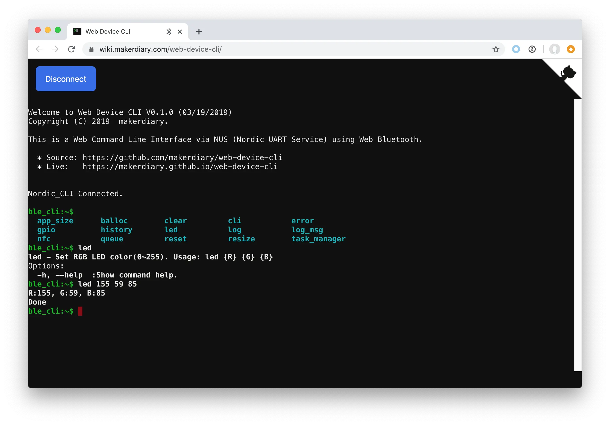

# BLE CLI Example

## Description

The Command Line Interface over BLE (BLE CLI) Application is an example that demonstrates how BLE NUS (Nordic UART service) can be used as a transport for a console.

[Web Device CLI](https://github.com/makerdiary/web-device-cli) is a web-based command line interface using Web Bluetooth API. It implements the Nordic UART Service (NUS) with Bluetooth Low Energy. This web utility can be used to connect to the BLE CLI example.

!!! Tip
	Before you start building, remember to set up the nRF5 SDK development environment first. See [Setup the nRF5 SDK](../setup.md) for details.

## Building the example

You can find the source code and the project file of the example in the following folder: [examples/nrf5-sdk/ble_app_cli](https://github.com/makerdiary/nrf52840-m2-devkit/tree/master/examples/nrf5-sdk/ble_app_cli).

Open terminal and navigate to the directory with the example Makefile:

``` sh
cd ./examples/nrf5-sdk/ble_app_cli/armgcc
```

Run `make merge` to build the application and merge with the Softdevice:

``` sh
make merge
```

## Programming the firmware

If compiled successfully, the firmware is located in `ble_app_cli/armgcc/_build` with the name `nrf52840_xxaa_s140.hex`.

Connect the debugger USB port to your PC using the provided USB-C Cable. A disk drive called **M2-DOCK** will be automatically detected by the computer.


Run the following command in `ble_app_cli/armgcc` to program the board:

``` sh
make flash_all
```

!!! Tip
	See **[Programming](../../programming.md)** section for details about how to program the nRF52840 M.2 Module.

## Testing

Perform the following steps to test the BLE CLI example:

1. Open the [Web Device CLI](https://wiki.makerdiary.com/web-device-cli/) page in a Chrome 56+ [browser](https://github.com/WebBluetoothCG/web-bluetooth/blob/master/implementation-status.md).

	<a href="https://wiki.makerdiary.com/web-device-cli/" target="_blank"><button class="md-tile md-tile--primary"><svg xmlns="http://www.w3.org/2000/svg" viewBox="0 0 14 16" width="14" height="16"><path fill-rule="evenodd" d="M7 10h4v1H7v-1zm-3 1l3-3-3-3-.75.75L5.5 8l-2.25 2.25L4 11zm10-8v10c0 .55-.45 1-1 1H1c-.55 0-1-.45-1-1V3c0-.55.45-1 1-1h12c.55 0 1 .45 1 1zm-1 0H1v10h12V3z"></path></svg> Web Device CLI</button></a>

2. Click <kbd>Connect</kbd> to scan devices.

3. Pair the **Nordic_CLI** discovered in the list.

4. Observe that the LED stays GREEN and the `ble_cli:~$` prompt is displayed.

5. Press the <kbd>Tab</kbd> on your keyboard to print the available commands.

6. Use command `led {R} {G} {B}` to set the RGB LED color and observe the RGB LED on the module.

[](assets/images/ble-app-cli-example.webp)

## Create an Issue

Interested in contributing to this project? Want to report a bug? Feel free to click here:

<a href="https://github.com/makerdiary/nrf52840-m2-devkit/issues/new?title=nRF5%20SDK-BLE%20CLI:%20%3Ctitle%3E"><button class="md-tile md-tile--primary"><svg xmlns="http://www.w3.org/2000/svg" viewBox="0 0 14 16" width="14" height="16"><path fill-rule="evenodd" d="M7 2.3c3.14 0 5.7 2.56 5.7 5.7s-2.56 5.7-5.7 5.7A5.71 5.71 0 011.3 8c0-3.14 2.56-5.7 5.7-5.7zM7 1C3.14 1 0 4.14 0 8s3.14 7 7 7 7-3.14 7-7-3.14-7-7-7zm1 3H6v5h2V4zm0 6H6v2h2v-2z"></path></svg> Create an Issue</button></a>
