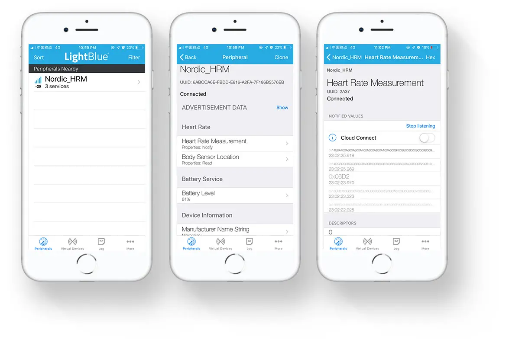

# BLE Heart Rate Sensor Example

## Description

The BLE Heart Rate Sensor Example is an example that implements the Heart Rate profile running on nRF52840 M.2 module.

The application includes the three services in the Heart Rate profile:

* Heart Rate Service
* Battery Service
* Device Information Service

When the application starts, the BSP is initialized. Then, three timers are started. These timers control the generation of various parts of the Heart Rate Measurement characteristic value:

* Heart Rate
* RR Interval
* Sensor Contact Detected

Also, a timer for generating battery measurements is started.

When notification of Heart Rate Measurement characteristic is enabled, the Heart Rate Measurement, containing the current value for all the components of the Heart Rate Measurement characteristic, is notified each time the Heart Rate measurement timer expires. 

When notification of Battery Level characteristic is enabled, the Battery Level is notified each time the Battery Level measurement timer expires.

!!! Tip
	Before you start building, remember to set up the nRF5 SDK development environment first. See [Setup the nRF5 SDK](../setup.md) for details.

## Building the example

You can find the source code and the project file of the example in the following folder: [examples/nrf5-sdk/ble_app_hrs](https://github.com/makerdiary/nrf52840-m2-devkit/tree/master/examples/nrf5-sdk/ble_app_hrs).

Open terminal and navigate to the directory with the example Makefile:

``` sh
cd ./examples/nrf5-sdk/ble_app_hrs/armgcc
```

Run `make merge` to build the application and merge with the Softdevice:

``` sh
make merge
```

## Programming the firmware

If compiled successfully, the firmware is located in `ble_app_hrs/armgcc/_build` with the name `nrf52840_xxaa_s140.hex`.

Connect the debugger USB port to your PC using the provided USB-C Cable. A disk drive called **M2-DOCK** will be automatically detected by the computer.


Run the following command in `ble_app_hrs/armgcc` to program the board:

``` sh
make flash_all
```

!!! Tip
	See **[Programming](../../programming.md)** section for details about how to program the nRF52840 M.2 Module.

## Testing

You can test the application with the **LightBlue** app by performing the following steps:

1. Download the **LightBlue** app from App Store or Google Play.

2. Connect to the device from LightBlue (the device is advertising as **Nordic_HRM**).

3. Observe that the services are shown in the connected device and that you can start receiving values for the **Heart Rate Measurement** and the **Battery Service** by clicking the `Listen for notifications`. Heart Rate notifications are received every second, and Battery Level notifications are received every two seconds.

	

4. Alternatively, you can visit the Web Bluetooth Demo page to test the example:

	<a href="https://wiki.makerdiary.com/WebBluetoothDemos/heart-rate-sensor/" target="_blank"><button class="md-tile md-tile--primary" style="width:auto;"><svg xmlns="http://www.w3.org/2000/svg" viewBox="0 0 14 16" width="14" height="16"><path fill-rule="evenodd" d="M11.5 8L8.8 5.4 6.6 8.5 5.5 1.6 2.38 8H0v2h3.6l.9-1.8.9 5.4L9 8.5l1.6 1.5H14V8h-2.5z"></path></svg> Web Bluetooth HRS</button></a>

	

## Create an Issue

Interested in contributing to this project? Want to report a bug? Feel free to click here:

<a href="https://github.com/makerdiary/nrf52840-m2-devkit/issues/new?title=nRF5%20SDK-BLE%20HRS:%20%3Ctitle%3E"><button class="md-tile md-tile--primary"><svg xmlns="http://www.w3.org/2000/svg" viewBox="0 0 14 16" width="14" height="16"><path fill-rule="evenodd" d="M7 2.3c3.14 0 5.7 2.56 5.7 5.7s-2.56 5.7-5.7 5.7A5.71 5.71 0 011.3 8c0-3.14 2.56-5.7 5.7-5.7zM7 1C3.14 1 0 4.14 0 8s3.14 7 7 7 7-3.14 7-7-3.14-7-7-7zm1 3H6v5h2V4zm0 6H6v2h2v-2z"></path></svg> Create an Issue</button></a>


