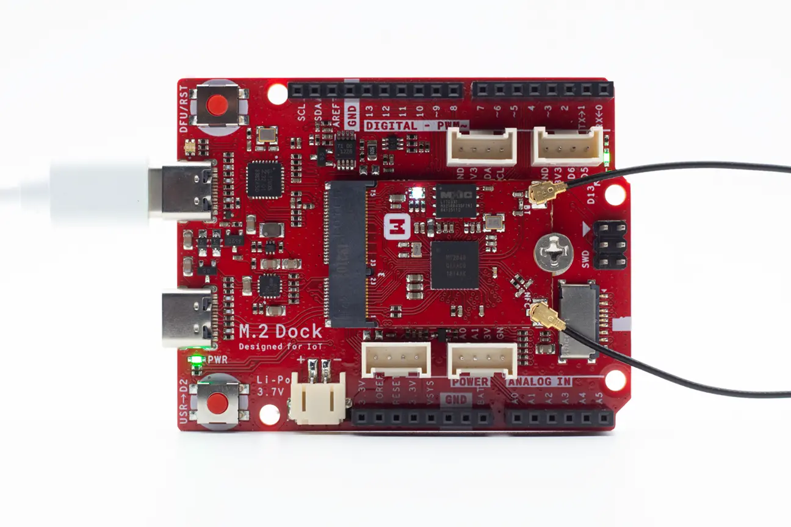

# Blinky Example

## Description

The Blinky Example demonstrates how to configure the GPIO pins to drive the LEDs. 

!!! Tip
	Before you start building, remember to set up the nRF5 SDK development environment first. See [Setup the nRF5 SDK](../setup.md) for details.

## Building the example

The source code and the project file of the example are located in the following folder: [examples/nrf5-sdk/blinky](https://github.com/makerdiary/nrf52840-m2-devkit/tree/master/examples/nrf5-sdk/blinky).

Open terminal and navigate to the directory with the example Makefile:

``` sh
cd ./examples/nrf5-sdk/blinky/armgcc
```

Run `make` to build the example:

``` sh
make
```

## Programming the firmware

After compiled, the firmware is located in `blinky/armgcc/_build` with the name `nrf52840_xxaa.hex`.

Connect the debugger USB port to your PC using the provided USB-C Cable. A disk drive called **M2-DOCK** will be automatically detected by the computer.


Run the following command in `blinky/armgcc` to program the board:

``` sh
make flash_all
```

!!! Tip
	See **[Programming](../../programming.md)** section for more details about how to program the nRF52840 M.2 Module.

## Testing

After programmed, the application will run automatically. Observe that the LEDs will start to blink as shown in this figure:




## Create an Issue

Interested in contributing to this project? Want to report a bug? Feel free to click here:

<a href="https://github.com/makerdiary/nrf52840-m2-devkit/issues/new?title=nRF5%20SDK-Blinky:%20%3Ctitle%3E"><button class="md-tile md-tile--primary"><svg xmlns="http://www.w3.org/2000/svg" viewBox="0 0 14 16" width="14" height="16"><path fill-rule="evenodd" d="M7 2.3c3.14 0 5.7 2.56 5.7 5.7s-2.56 5.7-5.7 5.7A5.71 5.71 0 011.3 8c0-3.14 2.56-5.7 5.7-5.7zM7 1C3.14 1 0 4.14 0 8s3.14 7 7 7 7-3.14 7-7-3.14-7-7-7zm1 3H6v5h2V4zm0 6H6v2h2v-2z"></path></svg> Create an Issue</button></a>
