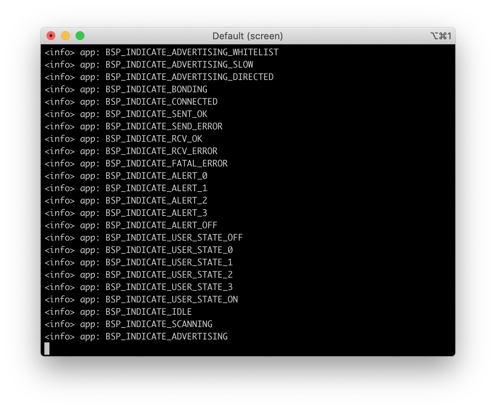

# BSP Example

## Description

The Board Support Package (BSP) Example shows how to use the Board Support Package (BSP) module. 

In this example, when the USER button is pressed, this callback function will change the BSP state and then configure BSP indicators to the required state.

!!! Tip
	Before you start building, remember to set up the nRF5 SDK development environment first. See [Setup the nRF5 SDK](../setup.md) for details.

## Building the example

The source code and the project file of the example are located in the following folder: [examples/nrf5-sdk/bsp](https://github.com/makerdiary/nrf52840-m2-devkit/tree/master/examples/nrf5-sdk/bsp).

Open terminal and navigate to the directory with the example Makefile:

``` sh
cd ./examples/nrf5-sdk/bsp/armgcc
```

Run `make` to build the example:

``` sh
make
```

## Programming the firmware

After compiled, the firmware is located in `bsp/armgcc/_build` with the name `nrf52840_xxaa.hex`.

Connect the debugger USB port to your PC using the provided USB-C Cable. A disk drive called **M2-DOCK** will be automatically detected by the computer.


Drag and drop the firmware `nrf52840_xxaa.hex` onto the **M2-DOCK** drive, or run the following command in `blinky/armgcc` to program the board:

``` sh
make flash
```

!!! Tip
	See **[Programming](../../programming.md)** section for details about how to program the nRF52840 M.2 Module.

## Testing

Test the example by performing the following steps:

Run a terminal application like [PuTTY](https://www.chiark.greenend.org.uk/~sgtatham/putty/) or [screen](https://www.gnu.org/software/screen/manual/screen.html):

``` sh
screen /dev/cu.usbmodem14102 115200
```

Press the USER button and observe the LEDs and output of the terminal.




## Create an Issue

Interested in contributing to this project? Want to report a bug? Feel free to click here:

<a href="https://github.com/makerdiary/nrf52840-m2-devkit/issues/new?title=nRF5%20SDK-BSP:%20%3Ctitle%3E"><button data-md-color-primary="red-bud"><i class="fa fa-github"></i> Create an Issue</button></a>
