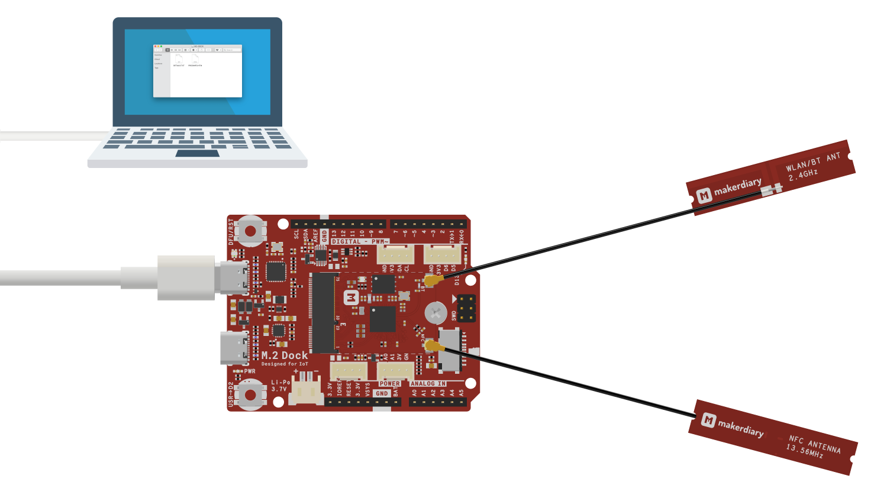
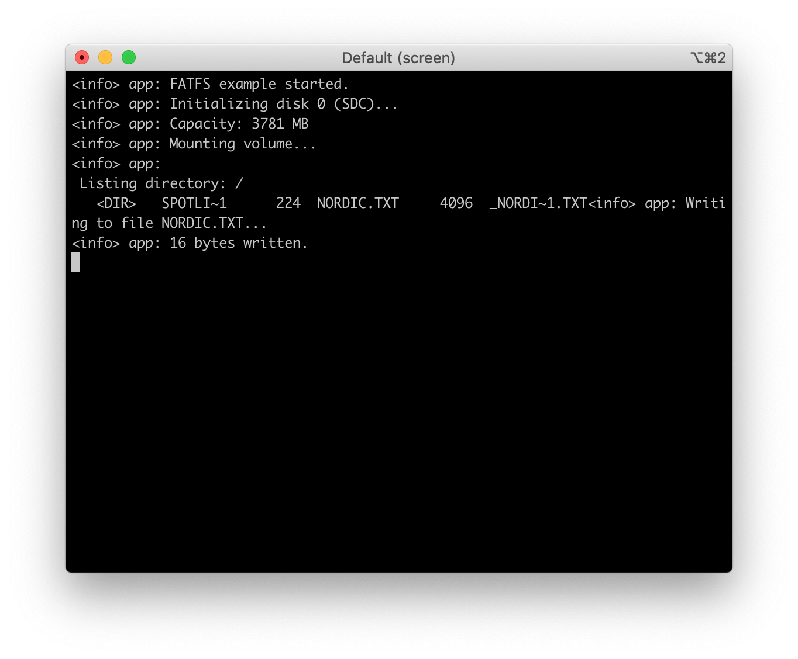

# microSD Card Example

## Description

The microSD Card Example demonstrates the use of a microSD memory card using the SD Card library and the FatFs file system library.

The example initializes the card and performs basic operations like mounting the FAT volume, listing the files, and writing the example file.

!!! Tip
	Before you start building, remember to set up the nRF5 SDK development environment first. See [Setup the nRF5 SDK](../setup.md) for details.


## Building the example

The source code and the project file of the example are located in the following folder: [examples/nrf5-sdk/fatfs](https://github.com/makerdiary/nrf52840-m2-devkit/tree/master/examples/nrf5-sdk/fatfs).

Open terminal and navigate to the directory with the example Makefile:

``` sh
cd ./examples/nrf5-sdk/fatfs/armgcc
```

Run `make` to build the example:

``` sh
make
```

## Programming the firmware

If compiled successfully, the firmware is located in `fatfs/armgcc/_build` with the name `nrf52840_xxaa.hex`.

Connect the debugger USB port to your PC using the provided USB-C Cable. A disk drive called **M2-DOCK** will be automatically detected by the computer.




Run the following command in `fatfs/armgcc` to program the board:

``` sh
make flash_all
```

!!! Tip
	See **[Programming](../../programming.md)** section for details about how to program the nRF52840 M.2 Module.

## Testing

Test the microSD Card Example application by performing the following steps:

1. Power down the board

2. Insert a **FAT formatted** microSD card into the microSD slot

3. Connect the debugger USB port to your PC

4. Run a terminal application like [PuTTY](https://www.chiark.greenend.org.uk/~sgtatham/putty/) or [screen](https://www.gnu.org/software/screen/manual/screen.html):

	``` sh
	screen /dev/cu.usbmodem14102 115200
	```

5. Observe the output of the terminal:

	


## Create an Issue

Interested in contributing to this project? Want to report a bug? Feel free to click here:

<a href="https://github.com/makerdiary/nrf52840-m2-devkit/issues/new?title=nRF5%20SDK-microSD:%20%3Ctitle%3E"><button data-md-color-primary="red-bud"><i class="fa fa-github"></i> Create an Issue</button></a>