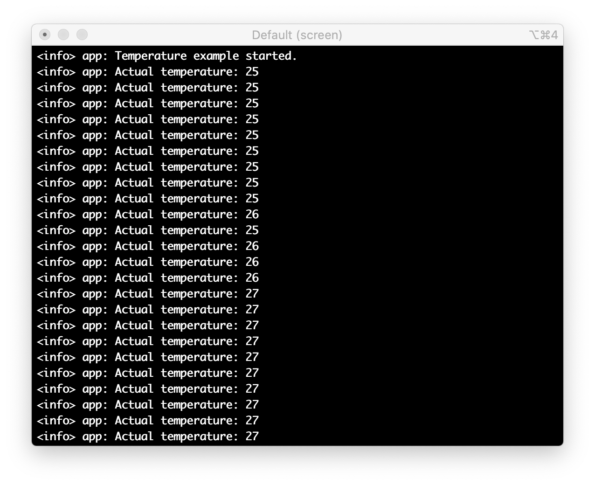

# Temperature Example

The Temperature Example shows how to use the temperature sensor inside the nRF52840 chip and print the measurement.

The application starts with configuring the temperature module and logging module. The main loop reads the temperature sensor and prints measurement every 500 milliseconds.

!!! Tip
	Before you start building, remember to set up the nRF5 SDK development environment first. See [Setup the nRF5 SDK](../setup.md) for details.

## Building the example

You can find the source code and the project file of the example in the following folder: [examples/nrf5-sdk/temperature](https://github.com/makerdiary/nrf52840-m2-devkit/tree/master/examples/nrf5-sdk/temperature).

Open terminal and navigate to the directory with the example Makefile:

``` sh
cd ./examples/nrf5-sdk/temperature/armgcc
```

Run `make` to build the example:

``` sh
make
```

## Programming the firmware

If compiled successfully, the firmware is located in `temperature/armgcc/_build` with the name `nrf52840_xxaa.hex`.

Connect the debugger USB port to your PC using the provided USB-C Cable. A disk drive called **M2-DOCK** will be automatically detected by the computer.


Run the following command in `temperature/armgcc` to program the board:

``` sh
make flash_all
```

!!! Tip
	See **[Programming](../../programming.md)** section for details about how to program the nRF52840 M.2 Module.

## Testing

Test the example by performing the following steps:

1. Connect the debugger USB port and run a terminal application like [PuTTY](https://www.chiark.greenend.org.uk/~sgtatham/putty/) or [screen](https://www.gnu.org/software/screen/manual/screen.html):

	``` sh
	screen /dev/cu.usbmodem14102 115200
	```

2. In the terminal window, observe that a temperature value is printed every 500 milliseconds.

	

## Create an Issue

Interested in contributing to this project? Want to report a bug? Feel free to click here:

<a href="https://github.com/makerdiary/nrf52840-m2-devkit/issues/new?title=nRF5%20SDK-Temperature:%20%3Ctitle%3E"><button data-md-color-primary="red-bud"><i class="fa fa-github"></i> Create an Issue</button></a>
