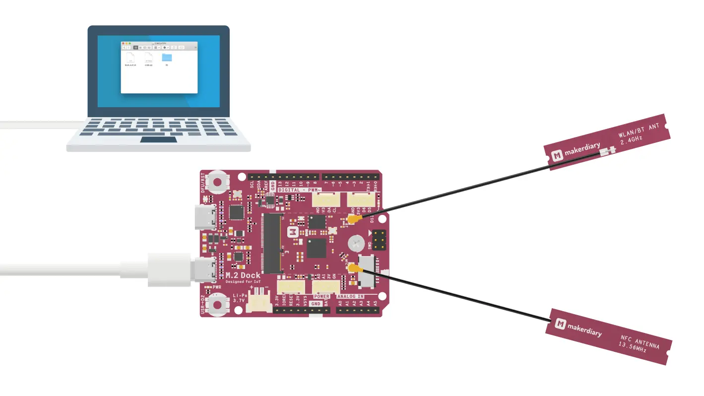

# Button Example

The Button Example demonstrates the use of GPIO input. The example prints a message to the console each time the state of the button changes.

The table below shows the available button on the nRF52840 M.2 Developer Kit:

| Button                | Pin      | Name             |
|-----------------------|----------|------------------|
| USER Button           | P0_19    | USR_BTN / D2     |

The USER button is pulled up. When the button is pressed, the input level of the button pin will be low (`False`).

Before you start coding, the Python Interpreter should be installed on the nRF52840 M.2 module correctly:

<a href="../../install"><button data-md-color-primary="red-bud" style="width:auto;">Install Python Interpreter</button></a>

## Run the code

Run the Button Example by performing the following steps:

1. Connect the **Module USB port** to your PC as shown in the figure below. A disk drive called **CIRCUITPY** should be automatically detected by the computer:

	

2. Open the `code.py` file on your **CIRCUITPY** drive, then copy and paste the following code. Your code will run as soon as the file is done saving.

	``` py
	import board
	import digitalio
	import time
	
	button = digitalio.DigitalInOut(board.USR_BTN)
	button.direction = digitalio.Direction.INPUT
	button.pull = digitalio.Pull.UP

	last_value = button.value

	while True:
		if last_value != button.value:
			last_value = button.value
			print('Button is ' + ('released' if button.value else 'pressed'))
	```

2. Start a terminal application like [PuTTY](https://www.chiark.greenend.org.uk/~sgtatham/putty/) or [screen](https://www.gnu.org/software/screen/manual/screen.html):

	``` sh
	screen /dev/cu.usbmodem14102 115200
	```

3. Press the USER button and observe the output of the terminal:

	


## Create an Issue

Interested in contributing to this project? Want to report a bug? Feel free to click here:

<a href="https://github.com/makerdiary/nrf52840-m2-devkit/issues/new?title=Python:%20Button:%20%3Ctitle%3E"><button data-md-color-primary="red-bud"><i class="fa fa-github"></i> Create an Issue</button></a>
