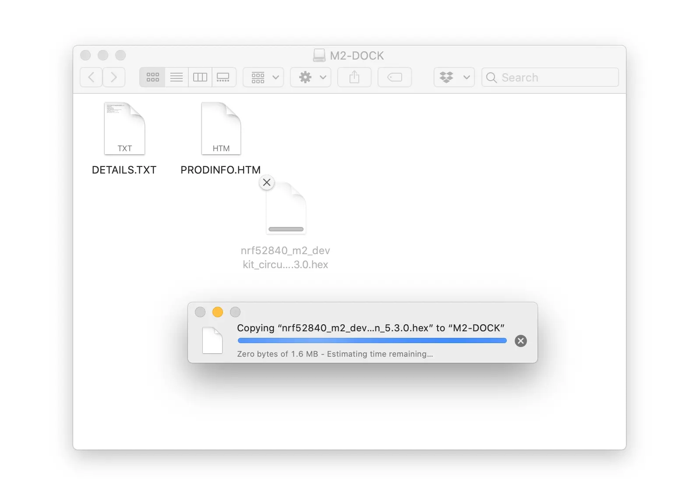
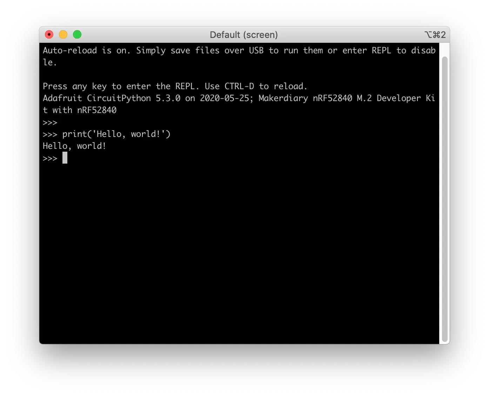

# Install Python Interpreter

This section describes how to install and verify the Python Interpreter on your nRF52840 M.2 Developer Kit.

## Prepare the firmware

The pre-built CircuitPython firmware for the nRF52840 M.2 Developer Kit is a `.hex` file. Download it into your local directory:

<a href="https://github.com/makerdiary/nrf52840-m2-devkit/tree/master/firmware/python/nrf52840_m2_devkit_circuitpython_5.3.0.hex"><button data-md-color-primary="red-bud" style="width:auto;">Download CircuiPython 5.3.0</button></a>

## Install Python

Install the Python Interpreter by performing the following steps:

1. Connect the **Debugger USB port** to your PC using the provided USB-C Cable. A disk drive called **M2-DOCK** will be automatically detected by the computer:

	

2. Drag and drop the firmware `nrf52840_m2_devkit_circuitpython_5.3.0.hex` onto the **M2-DOCK** drive:

	

3. Alternatively, you can run the following command to flash the firmware:

	``` sh
	pyocd flash -t nrf52840 nrf52840_m2_devkit_circuitpython_5.3.0.hex
	```

!!! Tip
	See **[Programming](../programming.md)** section for more details about how to program the nRF52840 M.2 Module.

## Verify the firmware

Once the Python Interpreter firmware is flashed, we can verify it by performing the following steps:

1. Connect the **Module USB port** to your PC as shown in the figure below. A disk drive called **CIRCUITPY** should be automatically detected by the computer:

	

2. Start a terminal application like [PuTTY](https://www.chiark.greenend.org.uk/~sgtatham/putty/) or [screen](https://www.gnu.org/software/screen/manual/screen.html):

	``` sh
	screen /dev/cu.usbmodem14102 115200
	```

3. In the terminal window, press any key to enter the Python REPL mode, and try some Python code:

	``` py
	>>> print('Hello, world!')
	```

	

## Next Steps

Now that you have the Python Interpreter installed, it's time to explore more examples for the nRF52840 M.2 Developer Kit:

* [Blinky](examples/blinky.md)
* [Button](examples/button.md)
* [microSD Card](examples/microsd.md)
* [LCD](examples/lcd.md)
* [USB HID Keyboard](examples/usb-keyboard.md)
* [BLE HID Keyboard](examples/ble-keyboard.md)

## Create an Issue

Interested in contributing to this project? Want to report a bug? Feel free to click here:

<a href="https://github.com/makerdiary/nrf52840-m2-devkit/issues/new?title=Install%20Python:%20%3Ctitle%3E"><button data-md-color-primary="red-bud"><i class="fa fa-github"></i> Create an Issue</button></a>