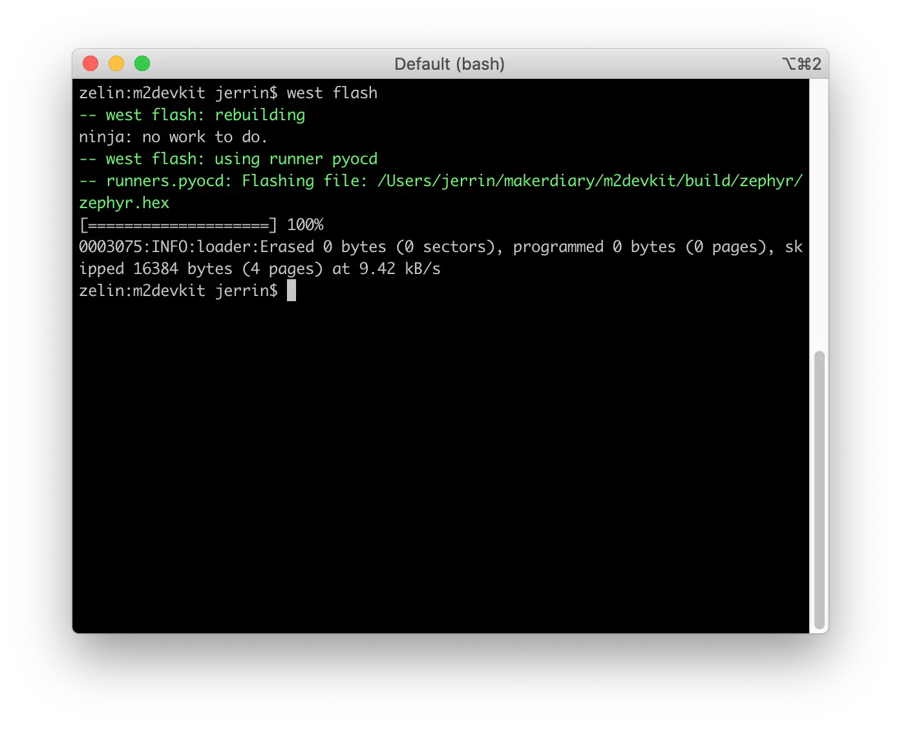

# Build and Run your first Zephyr example

This section details how to build and run the simple `Blinky` example.

Before you start building, remember to set up the Zephyr development environment first:

<a href="../setup"><button data-md-color-primary="red-bud" style="width:auto;">Setup Zephyr Toolchain</button></a>

## Build the Blinky example

Now it's ready to build your first Zephyr example. Will use the `Blinky` example here to keep it simple. 

The `Blinky` example shows how to blink the GREEN LED. The source code is located in [examples/zephyr/blinky](https://github.com/makerdiary/nrf52840-m2-devkit/tree/master/examples/zephyr/blinky).

1. Open terminal and navigate to the `m2devkit` directory created in the [Setup the toolchain](setup.md) section:

	``` sh
	cd <sourcecode_root>/m2devkit
	```

2. Use `west` to build the example:

	``` sh
	west build -b nrf52840_m2 nrf52840-m2-devkit/examples/zephyr/blinky
	```
	
	

!!! tip
	If a build system is present, make the build folder pristine before building:

	``` sh
	west build -t pristine
	```

## Flash the example

After compiled successfully, the firmware is located in `m2devkit/build/zephyr` with the name `zephyr.hex`.

Connect the debugger USB port to your PC using the provided USB-C Cable. A disk drive called **M2-DOCK** will be automatically detected by the computer.


Run the following command to flash the board:

``` sh
west flash
```



After programmed, the application will run automatically. Observe that the LED will start to blink as shown in this figure:


## Next Steps

Check out more Zephyr examples for nRF52840 M.2 Developer Kit:

* [Hello World](examples/hello-world.md)
* [Blinky](examples/blinky.md)
* [Button](examples/button.md)
* [SPI Flash](examples/spi-flash.md)
* [FAT Filesystem](examples/fat-fs.md)
* [LittlevGL](examples/littlevgl.md)
* [File System Shell](examples/shell-fs.md)
* [BLE Beacon](examples/ble-beacon.md)
* [BLE Peripheral DIS](examples/ble-dis.md)
* [BLE Peripheral HIDs](examples/ble-hids.md)

## Create an Issue

Interested in contributing to this project? Want to report a bug? Feel free to click here:

<a href="https://github.com/makerdiary/nrf52840-m2-devkit/issues/new?title=Building%20Zephyr%20Blinky:%20%3Ctitle%3E"><button data-md-color-primary="red-bud"><i class="fa fa-github"></i> Create an Issue</button></a>
