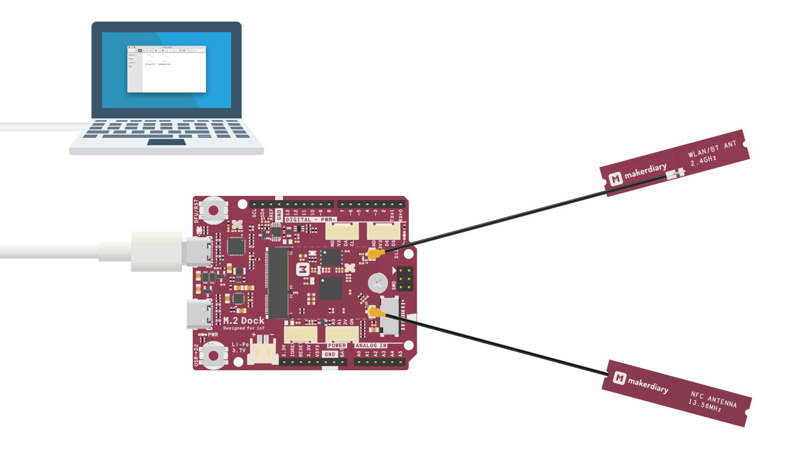
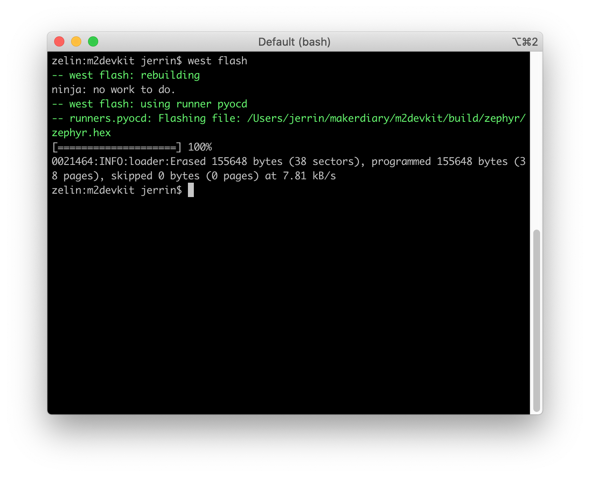
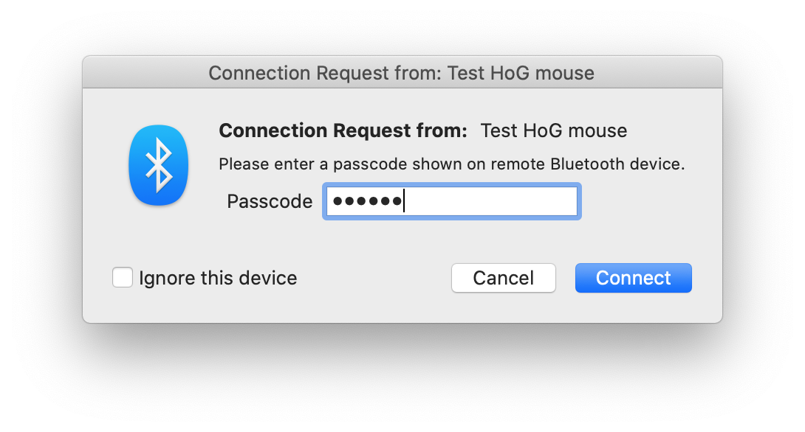

# Bluetooth: Peripheral HIDs Example

The Peripheral HIDs Example demonstrates how to use the Bluetooth Low Energy HID GATT Service. The report map used is for a generic mouse.

Before you start building, the Zephyr development environment should be set up correctly:

<a href="../../setup"><button data-md-color-primary="red-bud" style="width:auto;">Setup Zephyr Toolchain</button></a>

## Build the example

You can find the source code and the project file of the example in the following folder: [examples/zephyr/bluetooth/peripheral_hids](https://github.com/makerdiary/nrf52840-m2-devkit/tree/master/examples/zephyr/bluetooth/peripheral_hids).

Build the example by performing the following steps:

1. Open terminal and navigate to the `m2devkit` directory created in the [Setup the toolchain](../setup.md) section:

	``` sh
	cd <sourcecode_root>/m2devkit
	```

2. Use `west` to build the example:

	``` sh
	west build -b nrf52840_m2 nrf52840-m2-devkit/examples/zephyr/bluetooth/peripheral_hids
	```

	

!!! tip
	If a build system is present, make the build folder pristine before building:

	``` sh
	west build -t pristine
	```

## Flash the example

After compiled successfully, the firmware is located in `m2devkit/build/zephyr` with the name `zephyr.hex`.

Connect the debugger USB port to your PC using the provided USB-C Cable. A disk drive called **M2-DOCK** will be automatically detected by the computer.



Run the following command to flash the board:

``` sh
west flash
```



## Testing

Test the Peripheral HIDs Example application by performing the following steps:

1. Connect the debugger USB port to your PC

2. Run a terminal application like [PuTTY](https://www.chiark.greenend.org.uk/~sgtatham/putty/) or [screen](https://www.gnu.org/software/screen/manual/screen.html):

	``` sh
	screen /dev/cu.usbmodem14102 115200
	```

3. Press RESET button, and observe the output of the terminal:

	``` sh
	*** Booting Zephyr OS build zephyr-v2.2.0-727-gfc407574412a  ***
	Bluetooth initialized
	[00:00:00.174,438] <inf> fs_nvs: 4 Sectors of 4096 bytes
	[00:00:00.174,438] <inf> fs_nvs: alloc wra: 0, ff0
	[00:00:00.174,438] <inf> fs_nvs: data wra: 0, 0dvertising successfully started

	[00:00:00.175,994] <inf> bt_hci_core: HW Platform: Nordic Semiconductor (0x0002)
	[00:00:00.176,025] <inf> bt_hci_core: HW Variant: nRF52x (0x0002)
	[00:00:00.176,025] <inf> bt_hci_core: Firmware: Standard Bluetooth controller (0x00) Version 2.2 Build 99
	[00:00:00.176,330] <inf> bt_hci_core: No ID address. App must call settings_load()
	[00:00:00.178,619] <inf> bt_hci_core: Identity: f0:9f:05:d9:4f:45 (random)
	[00:00:00.178,649] <inf> bt_hci_core: HCI: version 5.1 (0x0a) revision 0x0000, manufacturer 0x05f1
	[00:00:00.178,649] <inf> bt_hci_core: LMP: version 5.1 (0x0a) subver 0xffff
	```

4. Use a computer with Bluetooth Low Energy supported to connect the device. Here goes with macOS: Go to **System Preferences** -> **Bluetooth Preferences**, observe that the BLE HID Mouse named **Test HoG mouse** is found and click <kbd>Connect</kbd>.

5. You will be asked for a passkey. Enter the passkey printed in the terminal, then click <kbd>Connect</kbd>:

	


## Create an Issue

Interested in contributing to this project? Want to report a bug? Feel free to click here:

<a href="https://github.com/makerdiary/nrf52840-m2-devkit/issues/new?title=Zephyr:%20BLE%20HIDs:%20%3Ctitle%3E"><button data-md-color-primary="red-bud"><i class="fa fa-github"></i> Create an Issue</button></a>
