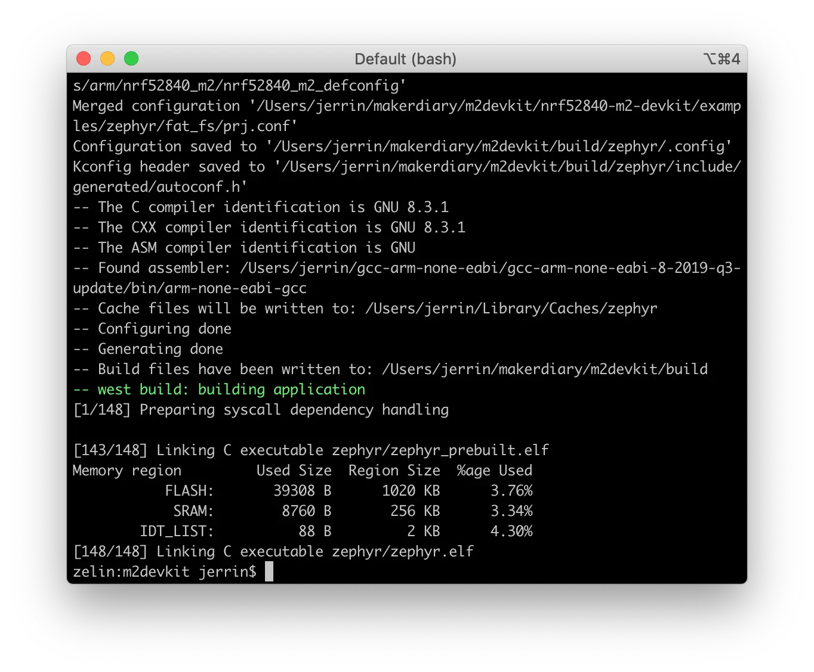
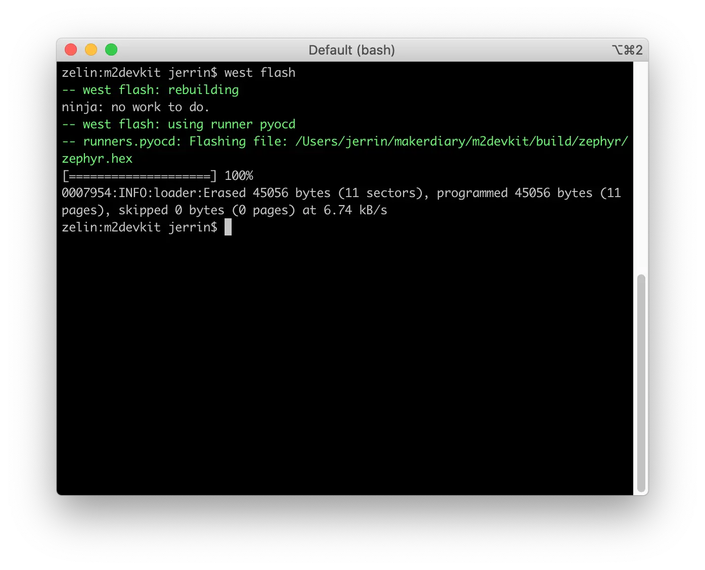
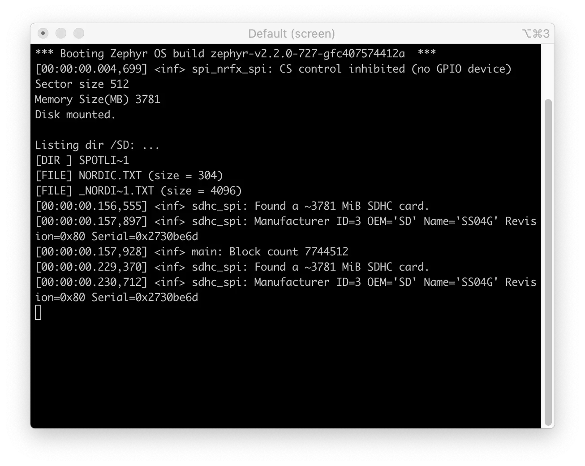

# FAT Filesystem Example

The FAT Filesystem Example demonstrates the use of the filesystem API and uses the FAT file system driver to mount a microSD card connected over a SPI bus.

Before you start building, the Zephyr development environment should be set up correctly:

<a href="../../setup"><button data-md-color-primary="red-bud" style="width:auto;">Setup Zephyr Toolchain</button></a>

## Build the example

You can find the source code and the project file of the example in the following folder: [examples/zephyr/fat_fs](https://github.com/makerdiary/nrf52840-m2-devkit/tree/master/examples/zephyr/fat_fs).

Build the example by performing the following steps:

1. Open terminal and navigate to the `m2devkit` directory created in the [Setup the toolchain](../setup.md) section:

	``` sh
	cd <sourcecode_root>/m2devkit
	```

2. Use `west` to build the example:

	``` sh
	west build -b nrf52840_m2 nrf52840-m2-devkit/examples/zephyr/fat_fs
	```
	
	

!!! tip
	If a build system is present, make the build folder pristine before building:

	``` sh
	west build -t pristine
	```

## Flash the example

After compiled successfully, the firmware is located in `m2devkit/build/zephyr` with the name `zephyr.hex`.

Connect the debugger USB port to your PC using the provided USB-C Cable. A disk drive called **M2-DOCK** will be automatically detected by the computer.


Run the following command to flash the board:

``` sh
west flash
```



## Testing

Test the FAT Filesystem Example application by performing the following steps:

1. Power down the board

2. Insert a **FAT formatted** microSD card into the microSD slot

3. Connect the debugger USB port to your PC

4. Run a terminal application like [PuTTY](https://www.chiark.greenend.org.uk/~sgtatham/putty/) or [screen](https://www.gnu.org/software/screen/manual/screen.html):

	``` sh
	screen /dev/cu.usbmodem14102 115200
	```

5. Press RESET button, and observe the output of the terminal:

	

## Create an Issue

Interested in contributing to this project? Want to report a bug? Feel free to click here:

<a href="https://github.com/makerdiary/nrf52840-m2-devkit/issues/new?title=Zephyr:%20FAT%20FS:%20%3Ctitle%3E"><button data-md-color-primary="red-bud"><i class="fa fa-github"></i> Create an Issue</button></a>
