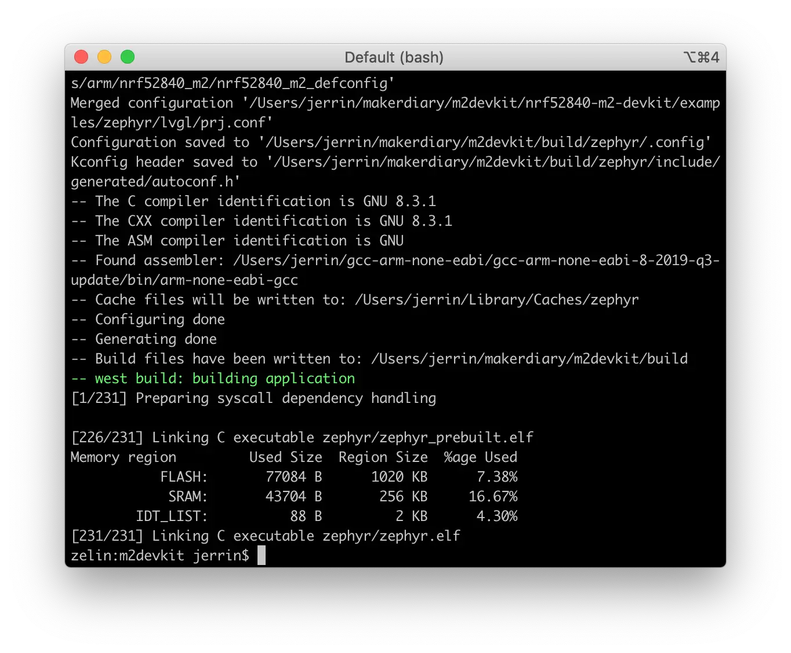
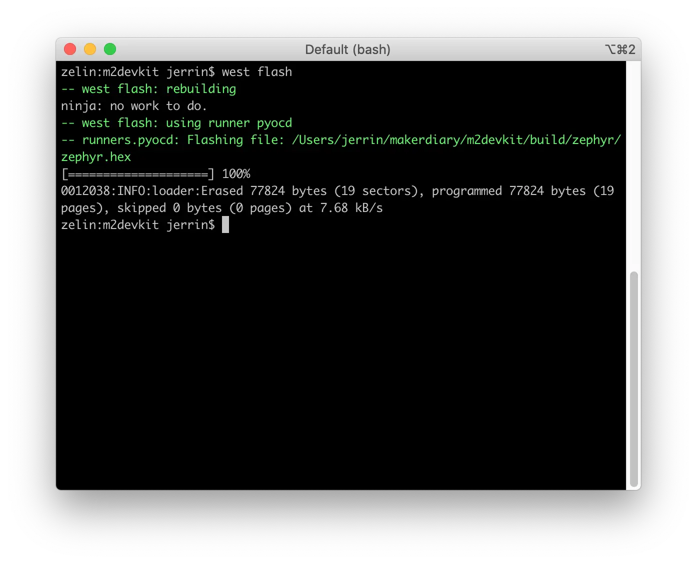
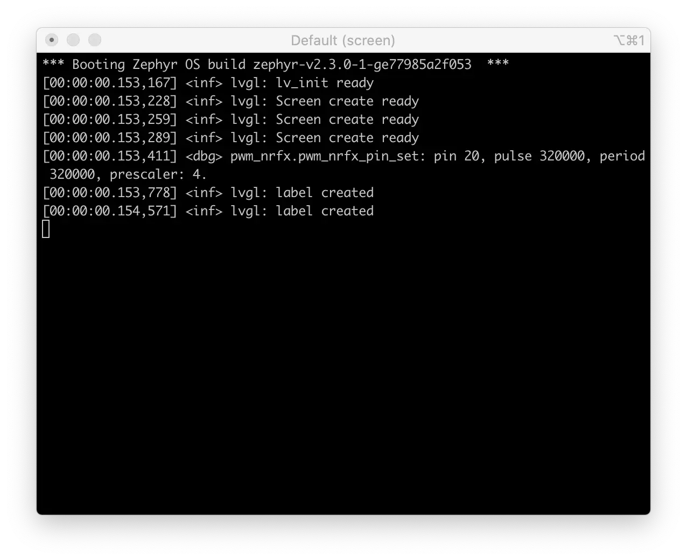

# LittlevGL Example

The LittlevGL Example demonstrates how to use the LittlevGL library API functions to draw graphic objects on the LCD.

This sample application displays “Hello World” in the center of the screen and a counter at the bottom which increments every second.

Before you start building, the Zephyr development environment should be set up correctly:

<a href="../../setup"><button class="md-issue-button md-issue-button--primary" style="width:auto;">Setup Zephyr Toolchain</button></a>

## Build the example

You can find the source code and the project file of the example in the following folder: [examples/zephyr/lvgl](https://github.com/makerdiary/nrf52840-m2-devkit/tree/master/examples/zephyr/lvgl).

Build the example by performing the following steps:

1. Open terminal and navigate to the `m2devkit` directory created in the [Setup the toolchain](../setup.md) section:

	``` sh
	cd <sourcecode_root>/m2devkit
	```

2. Use `west` to build the example:

	``` sh
	west build -b nrf52840_m2 nrf52840-m2-devkit/examples/zephyr/lvgl
	```
	
	

!!! tip
	If a build system is present, make the build folder pristine before building:

	``` sh
	west build -t pristine
	```

## Flash the example

After compiled successfully, the firmware is located in `m2devkit/build/zephyr` with the name `zephyr.hex`.

Connect the debugger USB port to your PC using the provided USB-C Cable. A disk drive called **M2-DOCK** will be automatically detected by the computer.


Run the following command to flash the board:

``` sh
west flash
```



## Testing

Test the LittlevGL Example application by performing the following steps:

1. Connect the debugger USB port to your PC

2. Run a terminal application like [PuTTY](https://www.chiark.greenend.org.uk/~sgtatham/putty/) or [screen](https://www.gnu.org/software/screen/manual/screen.html):

	``` sh
	screen /dev/cu.usbmodem14102 115200
	```

3. Press RESET button, and observe the output of the terminal:

	

4. Observe the graphic objects on the LCD screen:


## Create an Issue

Interested in contributing to this project? Want to report a bug? Feel free to click here:

<a href="https://github.com/makerdiary/nrf52840-m2-devkit/issues/new?title=Zephyr:%20LittlevGL:%20%3Ctitle%3E"><button class="md-issue-button md-issue-button--primary"><svg xmlns="http://www.w3.org/2000/svg" viewBox="0 0 14 16" width="14" height="16"><path fill-rule="evenodd" d="M7 2.3c3.14 0 5.7 2.56 5.7 5.7s-2.56 5.7-5.7 5.7A5.71 5.71 0 011.3 8c0-3.14 2.56-5.7 5.7-5.7zM7 1C3.14 1 0 4.14 0 8s3.14 7 7 7 7-3.14 7-7-3.14-7-7-7zm1 3H6v5h2V4zm0 6H6v2h2v-2z"></path></svg> Create an Issue</button></a>
