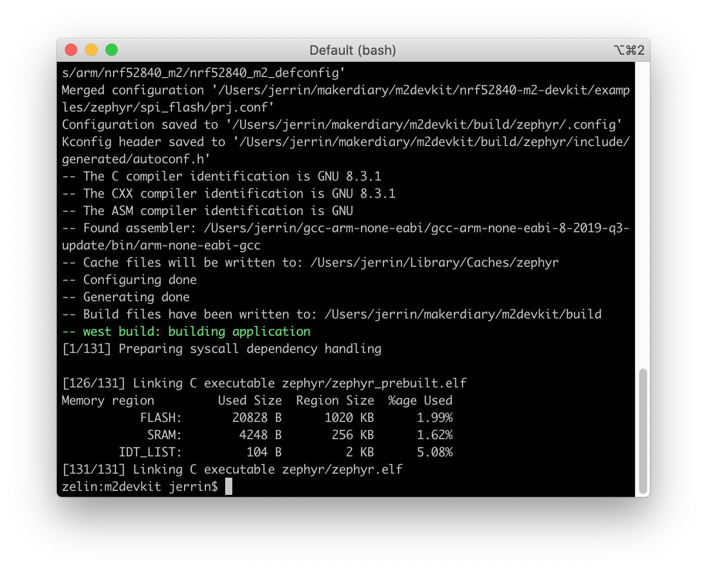
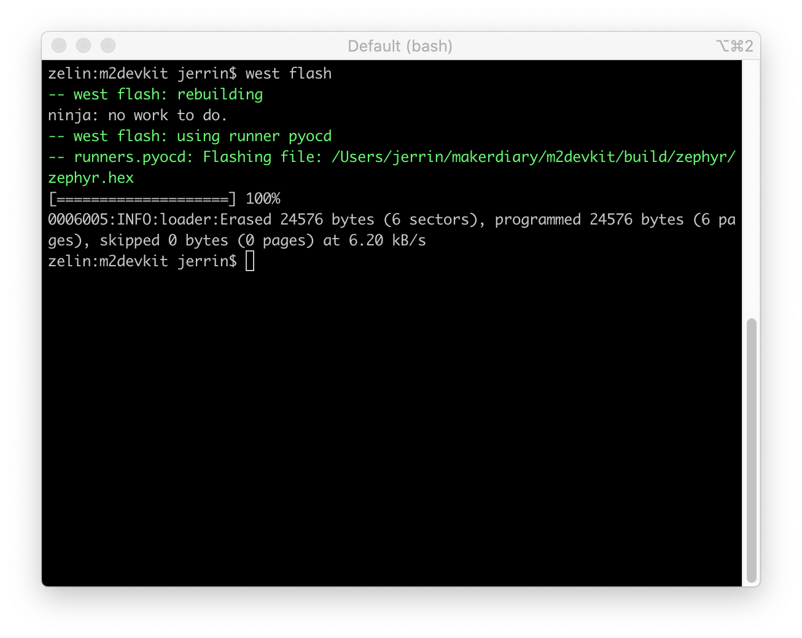
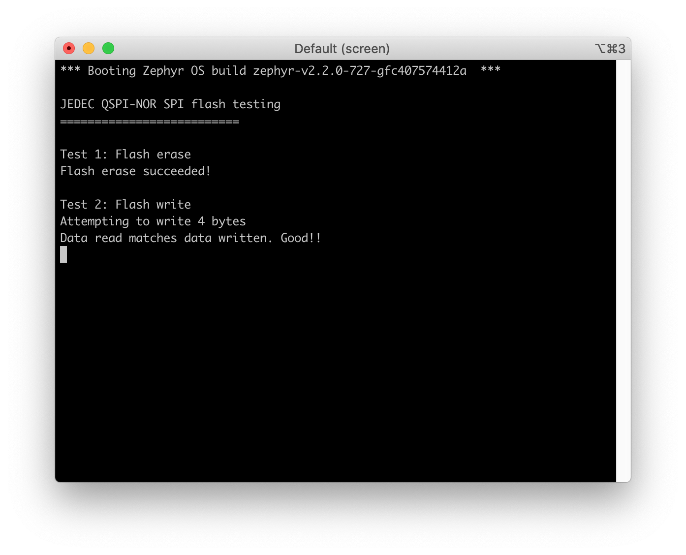

# SPI Flash Example

The SPI Flash Example demonstrates the use of the QSPI peripheral with the memory mounted on nRF52840 M.2 Module.

 The application initializes the QSPI peripheral, erases the memory, writes data, reads data, and compares data.

Before you start building, the Zephyr development environment should be set up correctly:

<a href="../../setup"><button data-md-color-primary="red-bud" style="width:auto;">Setup Zephyr Toolchain</button></a>

## Build the example

You can find the source code and the project file of the example in the following folder: [examples/zephyr/spi_flash](https://github.com/makerdiary/nrf52840-m2-devkit/tree/master/examples/zephyr/spi_flash).

Build the example by performing the following steps:

1. Open terminal and navigate to the `m2devkit` directory created in the [Setup the toolchain](../setup.md) section:

	``` sh
	cd <sourcecode_root>/m2devkit
	```

2. Use `west` to build the example:

	``` sh
	west build -b nrf52840_m2 nrf52840-m2-devkit/examples/zephyr/spi_flash
	```
	
	

!!! tip
	If a build system is present, make the build folder pristine before building:

	``` sh
	west build -t pristine
	```

## Flash the example

After compiled successfully, the firmware is located in `m2devkit/build/zephyr` with the name `zephyr.hex`.

Connect the debugger USB port to your PC using the provided USB-C Cable. A disk drive called **M2-DOCK** will be automatically detected by the computer.


Run the following command to flash the board:

``` sh
west flash
```



## Testing

Test the Button Example application by performing the following steps:

1. Run a terminal application like [PuTTY](https://www.chiark.greenend.org.uk/~sgtatham/putty/) or [screen](https://www.gnu.org/software/screen/manual/screen.html):

	``` sh
	screen /dev/cu.usbmodem14102 115200
	```

2. Press the RESET button, and observe the output of the terminal:

	

## Create an Issue

Interested in contributing to this project? Want to report a bug? Feel free to click here:

<a href="https://github.com/makerdiary/nrf52840-m2-devkit/issues/new?title=Zephyr:%20SPI%20Flash:%20%3Ctitle%3E"><button data-md-color-primary="red-bud"><i class="fa fa-github"></i> Create an Issue</button></a>
