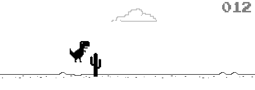

Dino
====



This is a replica of the hidden game - Dino at Chrome offline page.

## Requirements
+ [Adafruit CircuitPython ImageLoad](https://github.com/adafruit/Adafruit_CircuitPython_ImageLoad)

## Setup
1.  Download [Adafruit CircuitPython ImageLoad](https://github.com/adafruit/Adafruit_CircuitPython_ImageLoad) and put it into the `lib` directory of the `CIRCUITPY` drive
2.  copy `dino.py` and all of `.bmp` files to the `CIRCUITPY` drive
3.  Change `code.py` to:

    ```
    import dino
    ```

The file tree is like:
```
D:.
├───lib
│    └───adafruit_imageload
├───cactus15x32.bmp
├───cactus24x50.bmp
├───cloud92x27.bmp
├───digital200x25.bmp
├───dinosaur132x47.bmp
├───game_over190x10.bmp
├───ground512x12.bmp
├───code.py
└───dino.py
```